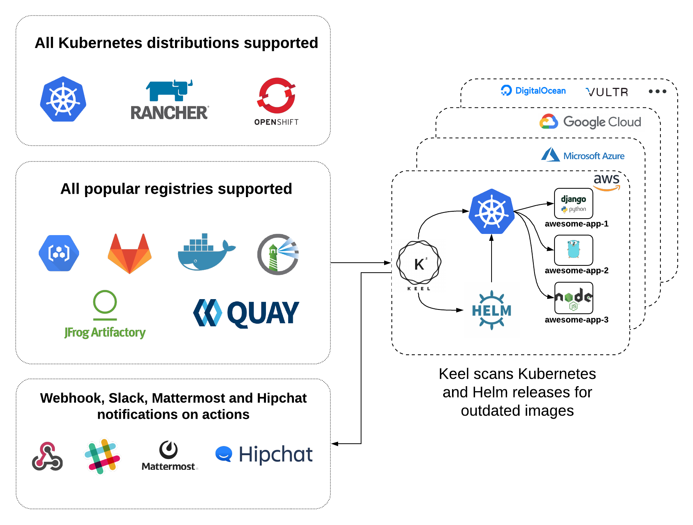
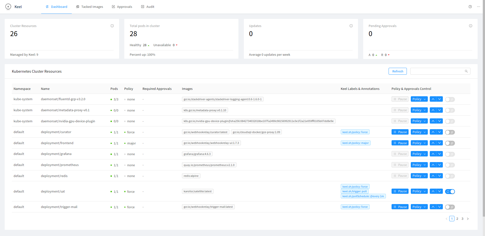

README.md
Keel Project Overview
Introduction
Keel is a tool designed to automatically update the container images of Kubernetes workloads when new versions are pushed to a Docker registry such as AWS ECR. It is particularly useful in continuous deployment (CD) scenarios where you want your applications to stay up-to-date with the latest images without manual intervention.

Purpose and Use Cases
Keel helps automate the deployment process by monitoring Docker registries for new image tags and updating the corresponding Kubernetes deployments. This is ideal for environments where frequent updates and rapid deployments are necessary, such as in development, staging, or production environments.

Key Features
Automated Image Updates: Keel monitors Docker registries and updates Kubernetes deployments when new images are available.
Support for Multiple Registries: It supports AWS ECR, Docker Hub, Google Container Registry (GCR), and more.
Polling and Webhook Triggers: Keel can use polling or webhooks to detect new images.
Role-Based Access Control (RBAC): Integrates with Kubernetes RBAC for secure operations.
Extensible Notifications: Supports Slack and other notification services for approvals and alerts.
Installation and Configuration
Prerequisites
Kubernetes cluster
Helm
AWS IAM Role with appropriate permissions if using AWS ECR
Setting Up Keel with Terraform and Helm
Below is an example of how to configure Keel using Terraform and Helm.

Terraform Configuration
Create Kubernetes Namespace for Keel:


````

resource "kubernetes_namespace" "keel" {
  metadata {
    name = "keel"
  }
}

````


``````
resource "aws_iam_role" "keel_role" {
  name = "KeelRole"

  assume_role_policy = jsonencode({
    Version = "2012-10-17",
    Statement = [
      {
        Effect = "Allow",
        Principal = {
          Service = "ec2.amazonaws.com"
        },
        Action = "sts:AssumeRole"
      }
    ]
  })
}

resource "aws_iam_role_policy" "keel_policy" {
  name = "KeelPolicy"
  role = aws_iam_role.keel_role.id

  policy = jsonencode({
    Version = "2012-10-17",
    Statement = [
      {
        Effect = "Allow",
        Action = [
          "ecr:*",
          "ec2:*"
        ],
        Resource = "*"
      }
    ]
  })
}

``````


Annotations for Deployments
To enable Keel for your Kubernetes deployments, you need to add specific annotations:


``````
metadata:
  annotations:
    keel.sh/policy: "all"
    keel.sh/trigger: "poll"
    keel.sh/pollSchedule: "@every 1m"
``````

Customization Options
Notification Configuration: Customize notifications via Slack, email, or other supported platforms.
Polling Interval: Adjust the polling interval to meet your needs.
RBAC Settings: Fine-tune RBAC settings for more secure operations.
Ingress and Service Types: Customize ingress settings and service types based on your network requirements.
Conclusion
Keel simplifies the continuous deployment process by automatically updating Kubernetes deployments with the latest container images. This ensures that your applications are always running the most recent versions with minimal manual intervention. By integrating Keel with Terraform and Helm, you can maintain a robust, automated deployment pipeline that supports rapid development and deployment cycles.



